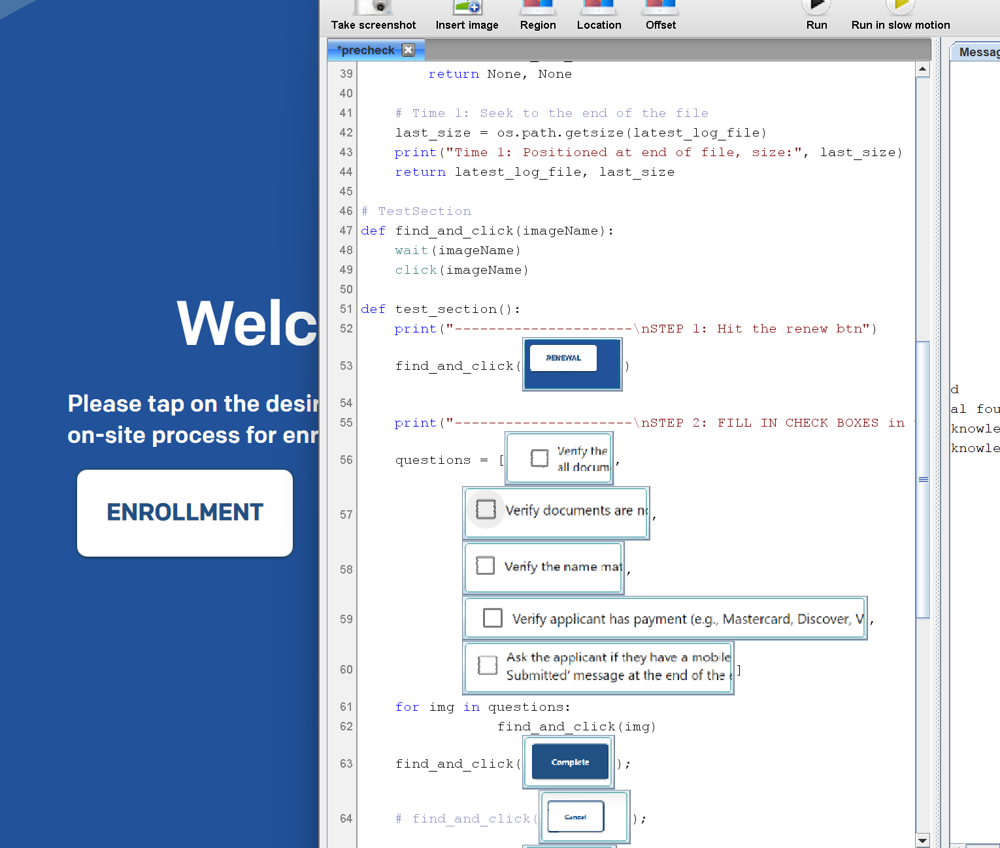

# bdd_sikuli
https://github.com/mulefish/bdd

# What is sikuli? 
Image based BDD: It uses Java to house a C powered OpenCV mechanism and python for its gui 

# What is Jython? 
Python + Java

# dependencies: 
java ( I have version 23 )   
python ( I have 3.12 )   
sikulixide-2.0.5.jar ( https://launchpad.net/sikuli/+milestone/2.0.5 ) 

# screenshot: 
 
